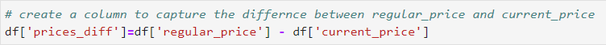
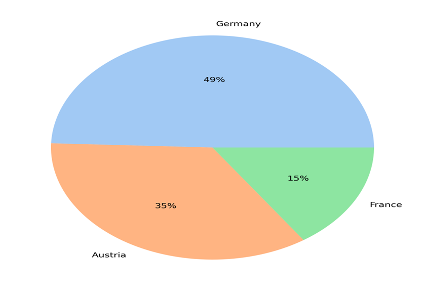
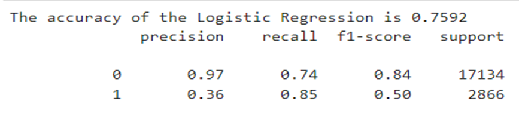

# Sports Wear Group Classification Project

## 1-Business Overiview
- Sports Wear Group is one of the leading retailers industry in the region, with more than 50 branches across the region. It runs multiple lines of business applications, mainly in the sport goods industry. They are in the middle of their digital transformation journey and they want to keep leading the market by satisfying their customers and meeting their expectation.
## 2-Business Objective
- The Business Objective is to use advanced analytics to **increase** their sports wear **sales** and to **increase** the efficiency of their **marketing** campaigns.
## 3-Current Solution
- The company is depending on the **marketing campaigns** to increase sales without using **advanced analytics** to analyze customer behaviors and patterns.
- The **advertisements** result after presenting the offers to `100k` customer have `13.9%` **success rate**.
## 4-Frame The Problem
- Given we have a **labeled** Dataset and the labels consists of **0** and **1** values. 
This is a **Superivised Binary Classification task**.
## 5-Performance Measure
- Since we are dealing with a **classification problem**, We can use **Accuracy, Confusion matrix, Precision, Recall, F1-score**  
Incase of a **imblanced dataset**, **Accuracy** won't be a good option.  

## Data Understanding
-  **List of Attributes:**
    - **country**: Country name
    - **article**: 6 digit article number, as unique identifier of an article
    - **sales**: Total number of units sold in respective retail week
    - **regular_price**: Recommended retail price of the article
    - **current_price**: Current selling price (weighted average over the week)
    - **ratio**: Price ratio as current_price/regular_price, such that price discount is 1-ratio
    - **retailweek**: Start date of the retailweek
    - **promo1**: Indicator for media advertisement, taking 1 in weeks of activation and 0 otherwise
    - **promo2**: Indicator for store events, taking 1 in weeks with events and 0 otherwise
    - **customer_id**: Customer unique identifier, one id per customer
    - **article**: 6 digit article number, as unique identifier of an article
    - **productgroup**: Product group the article belongs to
    - **category**: Product category the article belongs to
    - **cost**: Total costs of the article (assumed to be fixed over time)
    - **style**: Description of article design
    - **sizes**: Size range in which article is available
    - **gender**: Gender of target consumer of the article
    - **rgb_*_main_color**: Intensity of the red (r), green (g), and blue (b) primaries of the article‘s main color, taking values [0,250]
    - **rgb_*_sec_color**: Intensity of the red (r), green (g), and blue (b) primaries of the article‘s secondary color, taking values [0,250]
    - **label**: Advertisement result after offering/sending/presenting the offer to the customer. 0 means the customer did not buy and 1 means the costomer did buy.

- The Dataset consists of **100000** rows and **24** columns, With no **missing** values and no **duplicates**.
- The Dataset covers only **3 Countries** ``Germany, France, Austria``.
- The Dataset covers weekly sales happened from ``28 Dec 2014`` to ``30 April 2017``
- We are dealing with **Imbalanced Dataset** since, ``13.9%`` have labels of value ``1``.

## Data Preprocessing
- **Check for outliers:**
    
- **Create New Features**:
    
    
## Exploratory Data Analysis:
- **Correlation Matrix**:
    - **`salesPerWeak` has a small positive correlation with `discount` column**
    - **`regular_price`s, `current_prices` and `profit` columns have a highly positive correlation, it is better to derive a new feature from these two and use it instead**
    - **`discount` has a negative correlation with `profit`**
    - **`discount` has a positive correlation with `month`.**
    - **For the `label` column**:
        - **has a negative correlation with `discount`**
        - **has a small negative correlation with `sales` and a small positive correlation with `current_price`**

    
- **The Country with the highest Sales is ``Germany``, followed by ``Austria`` and ``France``, Take in mind that the data is imbalanced toward ``Germany``.**
    
    
 

- **Promo1 had been launched in all countries, Promo2 had been launched only in France.**
- **There is a relationship between sales and number of promos.**
- **While promo1 has approximately the same success rate in all countries, Promo2 had twice the success rate in France.**
    
    
 

- **The most purchased items are:**
    1. Shoes
    2. Hardware Accessories
    3. Sweatshirts
    4. Shorts
    
- **The month with the Highest purchases is Aug 2015**
- **It is noted that sales have a sharp decline in April, May, September, October.**
- **So, It is Recommended to launch media advertisements or store events in these months to increase the amount of sales**
    
- **The promos that happen mostly in December and slightly in January, increase the purchases in both January and February.**
- **The promos that happens in July and August, increase the purchases in these months significantly.**
- **So, promos take about a month or less to impact sales.**
    

- **Despite, Women having the highest number of purchases in the gender category.**
- **The percentage of purchases done in each category is approximately close.**
    
    

- **Training category has the highest number of purchases, followed by Football Generic, Running.**
    

- **The Most Purchases is done in regular size, followed by wide and slim sizes.**
    

- **The number of sales increases with higher discounts on products.**
    

- **Customers in Germany can pay prices that are approximately twice as expensive as those in France and Austria.**
- **We can increase purchases in both Austria and France by offering products at lower price.**

    
    

- **The 3 columns `salesPerWeek`, `regular_prices`, `current_prices` have a heavy tailed distribution, it might be helpful to take the log of values, to make it look more gaussian before we feature scale it.**
- **`customer_id` doesn't seem to have any value, so it is better to not use it**

- **Based on previous findings:**
    - If the company wants to increase its sales in low selling months, then It is recommended that the company focuses its campaigns and promotions during the months with the lowest number of sales to push these months sales higher.
    - However, If the company want to increase the sales of during holiday seasons like Christmas and summer, valentine’s day and black November, then the company should focus its campaign during these months.
    - Also, It is better to drop media campaigns before the season start within a month, to ensure the campaign is effective.
    - Focus on Store events instead of media advertisements in France and try push store events into Germany and Austria to see how well it will do there.
    - We can increase purchases in both Austria and France by offering products at lower price, Customers are purchasing products with low prices compared to customers in Germany.

## Feature Engineering
- Create a **Test set (80/20)** using **Stratified Sampling** to ensure the test set is representative of the whole dataset and to avoid **Sampling Bias.**
- **Feature Selection:**
    - Drop **product feature** will introduce a dimensionality problem if converted to categorical.
    - Drop **product.1** as it contain 10 values everyone has 10k instances, not needed.
    - Drop **regular price, current_price** as we drived new better features: **prices_diff and profit**.
    - Drop **ratio**, as we drived new feature **Discount**.
    - Drop **retailweek** and **day** as we have more representative features **month, year, month_year**
    - Drop **Customer_id**, It will introduce curse of dimensionality.
    - Drop **rgb_main and rgb_sec** 6 columns, as we derived two columns **hex_main and hex_sec**.
- Handling **Categorical Attributes**:
    - Apply **One-hot Encoding**.
- **Feature Scaling**:
    - Scale the features using **Standard Scaler**.

## Model building
- Build the whole **Transformation Pipeline**.
- **Select and Train a Model:**
    - **Logistic Regression**
    - **K-Nearest Neighbor**
    - **Random Forest**
- Handling the **imbalanced dataset:**
    - Use **SMOTE over Sampling**
    - Use **Random Over Sampling**
- **Fine Tuning the Best Model**

- **Evaluate the System on the test set**
     - **`Logistic Regression` is the best model, as it has the highest F1 score and accuracy compared to other models.**
    

### Code and Resources Used:
- **Python version:** 3.11.4
- **Packages:** Pandas, Numpy, Scikit-Learn, Matplotlib, Seaborn, Pickle, Imbalanced-Learn
- **Install Packages:** ``pip install -r requirements.txt``

